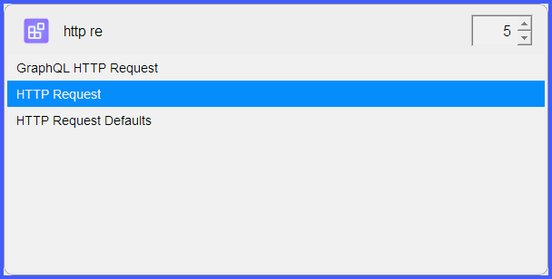

# 🔑 SuperKey — JMeter Plugin

> A blazing-fast command palette for Apache JMeter. Search components, run actions, and discover surprises — all from your keyboard.




---

## ✨ Features at a Glance

| Feature | Description |
|---|---|
| 🔍 **Component Search** | Instantly search and insert any JMeter component |
| ⚡ **Action Runner** | Execute built-in JMeter actions (Start, Stop, Save, Zoom…) |
| ⌨️ **Custom Shortcuts** | Define personal search aliases via `jmeter.properties` |
| 🎨 **Animated Border** | Google AI-inspired spinning gradient on open |
| 🪄 **Apple-style UI** | Rounded rectangle, draggable, auto-expanding dialog |
| 🥚 **Easter Eggs** | Hidden surprises for secret commands |

---

## 📦 Installation

1. Download or build the JAR (`superkey-jmeter-plugin-*.jar`)
2. Copy it to your JMeter `lib/ext/` directory:
   ```
   <JMETER_HOME>/lib/ext/superkey-jmeter-plugin-1.0-SNAPSHOT.jar
   ```
3. Restart JMeter

---

## 🚀 Quick Start

Open the SuperKey dialog with:

| OS | Default Shortcut |
|---|---|
| Windows / Linux | `Ctrl + K` |
| macOS | `Cmd + K` |

Or click the 🔑 **SuperKey button** on the JMeter toolbar (placed just before the Run button).

Also accessible via **Search → Super Key** in the JMeter menu bar.

---

## 🔍 Component Search

Type any part of a JMeter component name to instantly search across all available components:

- **HTTP Request** → type `http`
- **JDBC Request** → type `jdbc`
- **Thread Group** → type `thread`
- **Response Assertion** → type `assert`

Use the **number spinner** on the right to insert multiple copies at once.

**Keyboard navigation:**
- `↓` / `↑` — Move between results
- `Enter` — Insert selected component
- `Escape` — Close the dialog
- `Double-click` — Insert component

---

## ⚡ JMeter Action Runner

SuperKey also lists native JMeter GUI actions. Search for them just like components:

| Search Term | Action |
|---|---|
| `start` | Start test run |
| `stop` | Stop test run |
| `save` | Save test plan |
| `zoom in` | Zoom in on the tree |
| `zoom out` | Zoom out on the tree |
| `validate` | Validate test plan |
| `about` | Show JMeter about dialog |

> **Note:** The count spinner is automatically disabled when an action is selected (it only applies to component insertion).

Actions that could cause instability (e.g. `add`, `copy`, `paste`, `change_language`) are intentionally filtered out.

---

## ⌨️ Custom Shortcuts / Aliases

Define your own search aliases in `jmeter.properties` (or `user.properties`):

```properties
# Format: jmeter.superkey.custom=shortcut,component name;shortcut2,component name2
jmeter.superkey.custom=http,http request;jdbc,jdbc request;tg,thread group
```

**How it works:**
- Typing `http` will show results matching both `"http"` **and** the mapped alias `"http request"` — so you never miss natural matches.
- Aliases are **case-insensitive**.

**OS Smart-Swap:** If you configure `ctrl` on macOS, it's automatically translated to `cmd` (meta), and vice versa on Windows/Linux.

**Custom keyboard shortcut:**
```properties
jmeter.superkey.custom.shortcut=ctrl+shift+k
```

---

## 🎨 Animated Border

Every time the SuperKey dialog opens, a spinning gradient border animates in Google AI brand colors (blue, red, yellow, green):

- Spins for **~1.5 seconds**
- Fades out over **~1 second**
- Settles to a plain static border

---

## 🪄 Dialog UI Behaviour

- **Rounded rectangle** shape (Apple Spotlight-style)
- **Collapses** to a slim search bar when the field is empty
- **Expands** to show results as you type
- **Draggable** — click and drag anywhere on the dialog to reposition it
- Once dragged, the dialog **stays where you left it** (no auto-recentering)

---

## 🥚 Easter Eggs

Type these exact phrases into the search bar for a surprise:

| Command | Surprise |
|---|---|
| `hello` | Friendly welcome message |
| `hi` | Another greeting |
| `coffee` | Animated coffee brewing sequence ☕ |
| `matrix` | Matrix rain animation (click or wait 5s to close) |
| `42` | The Answer to Life, the Universe, and Everything |
| `flip` | Animated table flip `(╯°□°）╯︵ ┻━┻` |
| `jmeter rocks` | Fireworks animation 🎆 |
| `superkey` | Plugin info card |
| `stress` | Humorous stress relief tip |
| `↑↑↓↓←→←→ba` | **Konami Code** → Confetti explosion 🎉 |

> Easter eggs are **exact-match only** — they never appear in normal search results.

---

## 🔧 Configuration Reference

All configuration goes in `<JMETER_HOME>/bin/jmeter.properties` or `user.properties`:

```properties
# Custom search aliases (shortcut,component name pairs separated by semicolons)
jmeter.superkey.custom=http,http request;jdbc,jdbc request

# Custom keyboard shortcut to open SuperKey (default: Ctrl+K / Cmd+K)
# Supports: ctrl, shift, alt, meta/cmd and key names
# Example: jmeter.superkey.custom.shortcut=ctrl+shift+s
```

---

## 🛠️ Building from Source

**Prerequisites:** Java 17+, Maven 3.6+

```bash
git clone https://github.com/qainsights/superkey.git
cd superkey
mvn clean package
```

The JAR is built to `target/superkey-jmeter-plugin-*.jar`.

Deploy to JMeter:
```bash
cp target/superkey-jmeter-plugin-*.jar $JMETER_HOME/lib/ext/
```

---

## 🏗️ Architecture

```
SuperKeyMenuCreator   — Registers the plugin action, menu item, and toolbar button
SuperKeyDialog        — The main search UI (animated border, rounded rect, drag support)
ComponentProvider     — Discovers all JMeter components and native actions via reflection
SuperKeyInjector      — Inserts the selected component into the active JMeter tree node
EasterEggHandler      — All easter egg logic (animations, messages, confetti)
```

---

## 🤝 Contributing

Pull requests and issues are welcome!  
Please test with JMeter 5.6+ on Windows, macOS, and Linux.

---

## 📄 License

Apache License 2.0 — see [LICENSE](LICENSE) for details.

---

*Built with ❤️ by [NaveenKumar Namachivayam](https://github.com/qainsights) for JMeter power users.*
